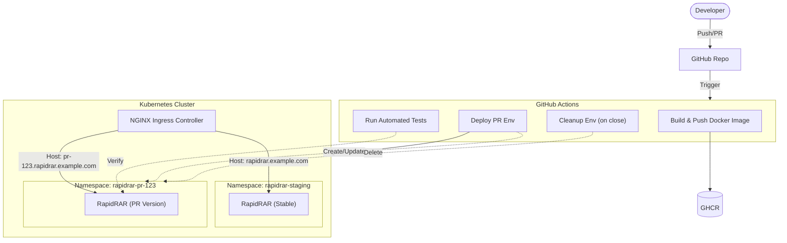

# Design Document: RapidRAR PR Preview Environments

## Goal
Enable safe, isolated testing of Pull Requests (PRs) within the shared staging Kubernetes cluster without disrupting other users.

## Architecture

### 1. Namespace Strategy
To ensure isolation, we will deploy each PR into its own **ephemeral Kubernetes Namespace**.
- **Naming Convention**: `rapidrar-pr-<PR_NUMBER>` (e.g., `rapidrar-pr-123`).
- **Benefits**:
    - Full isolation of resources (Services, ConfigMaps, Secrets).
    - Easy cleanup (deleting the namespace deletes everything).
    - Collision avoidance with the main `staging` namespace.

### 2. Routing (Ingress)
We will use **dynamic subdomains** to route traffic to specific PR versions.
- **Pattern**: `pr-<PR_NUMBER>.rapidrar.example.com`
- **Ingress Controller**: Standard NGINX Ingress Controller.
- **Implementation**: The Ingress resource in the ephemeral namespace will define this specific host. DNS needs a wildcard record `*.rapidrar.example.com` pointing to the Ingress LoadBalancer IP.

### 3. CI/CD Integration (GitHub Actions)
The workflow will handle the lifecycle of the environment:
1.  **On PR Open/Synchronize**: 
    - Build Docker image tagged with `pr-<PR_NUMBER>`.
    - Create Namespace `rapidrar-pr-<PR_NUMBER>`.
    - Deploy manifests (DaemonSet, Service, Ingress) substituting the image tag and hostname.
    - Run `test_k8s.py` against `http://pr-<PR_NUMBER>.rapidrar.example.com`.
2.  **On PR Close/Merge**:
    - Delete Namespace `rapidrar-pr-<PR_NUMBER>`.

## Implementation Details

### Deployment Tooling
We will use `kustomize` or simplified `sed` substitution for this prototype. For a production system, Helm or ArgoCD (ApplicationSet with Pull Request Generator) would be preferred.

### Limitations & Trade-offs
- **Resource Usage**: Each PR creates a full set of pods. In a monorepo with many services, this can be heavy.
    - *Mitigation*: Only deploy changed services, or use a "telepresence" style routing where only the changed service runs in the PR namespace and talks to staging for others. For this task (single service), full deployment is fine.
- **Node Ports/DaemonSets**: DaemonSets run on *every* node. For PRs, a `Deployment` with 1-2 replicas is usually sufficient and cheaper than a DaemonSet.
    - *Decision*: We will switch the PR deployment to a `Deployment` instead of `DaemonSet` to save resources, unless testing hardware access explicitly requires it on all nodes (which the prompt implies "every node" for the main task, but for PR testing, validation is key). I will stick to the existing manifest template but ideally scale it down.

## Future Work
- **Database Isolation**: If the app uses a DB, we need ephemeral DBs or schema separation.
- **Cost Management**: Auto-delete environments after X hours of inactivity.
