# RapidRAR Project Presentation

Use this document to present the project during an interview.

## 🚀 Overview: Challenge vs. Solution

| Task | Challenge | Key Solution | Tech Stack |
| :--- | :--- | :--- | :--- |
| **Task 1** | Run Python app on any OS (Mac M1/Linux) | **Multi-arch Docker Build** | Docker Buildx, QEMU |
| **Task 2** | Maximize CPU usage on all cluster nodes | **K8s DaemonSet** | Kubernetes, Python API |
| **Task 3** | Test PRs safely without breaking Staging | **Namespace Isolation** | GitHub Actions, Ingress |
| **Bonus** | Security & Cost Management | **App Auth & Auto-Cleanup** | API Key, K8s CronJob |

---

## 🐳 Task 1: Docker Containerization

**Goal**: Build once, run anywhere (amd64 & arm64).

### Key Decision: Multi-stage Build
We use a **multi-stage build** to keep the image small (~100MB) by discarding build tools.

```dockerfile
# Stage 1: Builder
FROM python:3.10-slim as builder
RUN apt-get update && apt-get install -y build-essential ...

# Stage 2: Final
FROM python:3.10-slim
COPY --from=builder /usr/local/lib/python3.10 /usr/local/lib/python3.10
# ...
```

### 💡 Impact
- **Speed**: Smaller images pull faster.
- **Compatibility**: Supports M1 Mac and production Linux servers transparently.

---

## ☸️ Task 2: Kubernetes Deployment

**Goal**: Deploy on **every node** for maximum cracking power.

### Key Decision: DaemonSet vs Deployment

> **Question**: Why not use a standard Deployment?
> **Answer**: A Deployment distributes Pods randomly. **DaemonSet** guarantees **exactly one Pod per node**.

```yaml
apiVersion: apps/v1
kind: DaemonSet  # <--- The "Secret Sauce"
metadata:
  name: rapidrar
spec:
  template:
    spec:
      containers:
      - name: rapidrar
        resources:
          requests:
            cpu: "500m"  # Reserve CPU for cracking
```

---

## 🛡️ Task 3: PR Preview Environments

**Goal**: Safely test PRs without conflicts.

### The Problem: Shared Staging
If Developer A and Developer B both push to `staging`, they overwrite each other.

### The Solution: "Parallel Universes" (Namespaces)
Every PR gets its own **Namespace**. It's like a temporary sandbox.


---

## 🔄 Task 3: Automation Workflow

How the complete CI/CD pipeline works for a PR:

```mermaid
sequenceDiagram
    participant Dev as Developer
    participant GH as GitHub Actions
    participant K8s as Kubernetes Cluster
    
    Dev->>GH: Open Pull Request
    GH->>GH: Build Docker Image (tag: pr-101)
    GH->>K8s: kubectl create namespace rapidrar-pr-101
    GH->>K8s: kubectl apply -f manifests/ (with image: pr-101)
    K8s-->>GH: Deployment Ready
    GH->>K8s: Run automated tests (test_k8s.py)
    GH->>Dev: ✅ CI Passed (Environment Ready)
    
    Note over Dev, K8s: ...Manual Testing...
    
    Dev->>GH: Merge PR
    GH->>K8s: kubectl delete namespace rapidrar-pr-101  <-- Cleanup
```



---

## 🌟 Bonus: Security & Ops

We went the extra mile to make it production-ready.

### 1. API Security
Prevent unauthorized access to the cracking cluster.
```python
# src/api.py
API_KEY_NAME = "X-API-Key"
async def get_api_key(header: str = Security(api_key_header)):
    if header != EXPECTED_KEY:
        raise HTTPException(403)
```

### 2. Cost Control (FinOps)
A **CronJob** that runs daily to clean up potential "zombie" environments.
```yaml
# k8s/cronjob-cleanup.yaml
schedule: "0 0 * * *"  # Daily at midnight
command: ["kubectl", "delete", "ns", "rapidrar-pr-*"]
```
