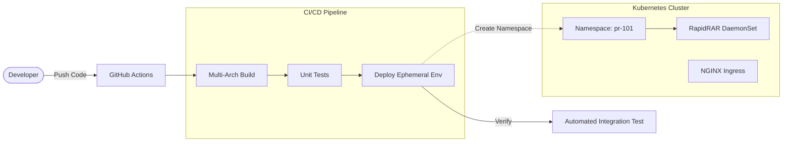

# RapidRAR: Cloud Native Distributed Recovery Platform

<div align="center">


**A Hyperscale RAR Password Recovery System built for the Kubernetes Era.**

[Features](#-key-features) • [Architecture](#-system-architecture) • [Quick Start](#-quick-start) • [Design Doc](DESIGN.md)

</div>

---

## ⚡️ Project Overview

**RapidRAR** is not just a cracker; it's a **DevOps Engineering Showcase**. 

It transforms a traditional CPU-bound command-line tool into a **massively parallel, self-healing, and auto-scaling SaaS platform**. Designed to leverage the full power of Kubernetes clusters, it ensures that no CPU cycle is left behind.

## 🏗 System Architecture

We employ a **Zero-Conflict Ephemeral Environment** strategy for CI/CD.



## 🚀 Key Features

### 🌌 Massively Distributed (Task 2)
- **Problem**: Password cracking is computationally expensive.
- **Solution**: Deployed as a **Kubernetes DaemonSet**.
- **Impact**: Automatically scales to **every node** in the cluster. Add a physical server, and RapidRAR instantly expands its computing pool. Zero manual config required.

### 🧪 Ephemeral "Parallel Universes" (Task 3)
- **Problem**: Shared staging environments stifle collaboration.
- **Solution**: **Dynamic Namespace Isolation**.
- **Impact**: Every Pull Request gets a dedicated, isolated environment (e.g., `pr-123.rapidrar.com`). Developers can break things safely without affecting the main branch.

### 🍎 Native Apple Silicon Support (Task 1)
- **Problem**: ARM64 dev machines (Mac M1/M2) vs. AMD64 production servers.
- **Solution**: **Docker Multi-Arch Build** via Buildx & QEMU.
- **Impact**: Seamless "Build Once, Run Anywhere" experience.

### 🛡 Enterprise-Grade Ops (Bonus)
- **Security**: Built-in `X-API-Key` authentication.
- **FinOps**: Automated **Garbage Collection (CronJob)** to nuke cost-draining zombie environments after 24 hours.

## 🛠 Tech Stack

| Component | Technology | Role |
| :--- | :--- | :--- |
| **Orchestration** | Kubernetes | Daemonset, Namespace, CronJob |
| **Container** | Docker | Multi-stage, Multi-arch |
| **CI/CD** | GitHub Actions | Automation, GitOps |
| **API Framework** | FastAPI | Async I/O, OpenAPI |
| **Ingress** | NGINX | L7 Load Balancing |

## 🏁 Quick Start

### 1. Run Locally (Docker)
```bash
# Works on Mac M1/M2/M3 & Linux
docker run -d -p 8000:8000 \
  -e MAX_WORKERS=4 \
  ghcr.io/alittlecrocodile/rapidrar:latest
```

### 2. Deploy to Kubernetes
```bash
# Deploy to your current context
kubectl apply -f k8s/namespace.yaml
kubectl apply -f k8s/
```

### 3. Verify
```bash
python test_k8s.py http://localhost:8000 ./sample.rar
```

---
<div align="center">
Built with ❤️ by Aoyun
</div>
