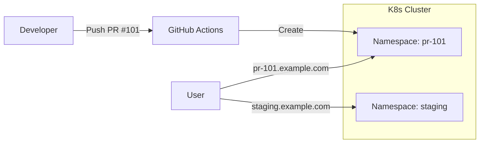

# RapidRAR DevOps Project

## Project Overview
This project adds DevOps capabilities to the RapidRAR application, including:
1.  **Containerization**: Docker support for amd64/arm64.
2.  **API Wrapper**: A new FastAPI layer (`src/api.py`) to expose cracking functionality over HTTP.
3.  **Kubernetes Support**: Manifests for deploying as a scalable service (DaemonSet + Ingress).
4.  **PR Previews**: A design and CI prototype for ephemeral preview environments per Pull Request.

## 🚀 Solution Showcase (Interview Highlights)

| Challenge | Solution | Tech Stack |
| :--- | :--- | :--- |
| **Cross-Platform Support** | Multi-arch Docker Build (amd64/arm64) | Docker Buildx, QEMU |
| **Max Cluster Utilization** | Kubernetes DaemonSet (One pod per node) | DaemonSet, K8s, Python |
| **Safe PR Testing** | Ephemeral Namespace Isolation | GitHub Actions, Namespaces |
| **Security & FinOps** | API Key Auth & Auto-Cleanup CronJob | FastAPI, K8s CronJob |

### 🛠 Architecture Overview
The core of this project is the **Ephemeral PR Environment** design, solving the "Shared Staging Conflict" problem.



### 💡 Key Design Decisions
1.  **DaemonSet vs Deployment**: Used **DaemonSet** for Task 2 to strictly guarantee "one pod per node" for maximum computational coverage, as opposed to random scheduling.
2.  **Namespace Isolation**: Chosen over header-based routing for cleaner isolation and easier cleanup (nuke the namespace = clean state).

## Deliverables

### Task 1: Docker
- **Dockerfile**: Located at root. Multi-stage build.
- **CI Workflow**: `.github/workflows/docker-build.yml` builds and pushes to GHCR.
- **Documentation**: See [DOCKER_usage.md](DOCKER_usage.md).

### Task 2: Kubernetes
- **Manifests**: Located in `k8s/`.
    - `deployment.yaml`: Configured as a DaemonSet.
    - `service.yaml`: ClusterIP service.
    - `ingress.yaml`: NGINX Ingress configuration.
- **Test Script**: `test_k8s.py` verifies the deployment by uploading a file to the API.

### Task 3: PR Preview Design
- **Design Doc**: See [DESIGN.md](DESIGN.md) for architectural decisions.
- **Workflow**: `.github/workflows/pr-deploy.yml` implements the logic to spin up `rapidrar-pr-<ID>` namespaces.
    
### Task 5: Bonus Optimizations (Security & Ops)
- **API Security**: Added `X-API-Key` authentication to `src/api.py`.
- **Cost Control**: `k8s/cronjob-cleanup.yaml` deploys a daily CronJob to delete PR environments older than 24 hours.

## Assumptions & Limitations
- **Unrar Dependency**: The `Dockerfile` attempts to install `unrar-free` and `p7zip-full`. Proprietary `unrar` may be needed for some RAR v5 archives but is harder to automate in Debian/Slim without non-free repos.
- **K8s Environment**: The manifests assume a standard cluster with NGINX Ingress Controller installed.
- **DaemonSet vs Deployment**: Task 2 requested deploying on "every node", so I used a DaemonSet. For PR previews, this is resource-intensive, so the design document suggests switching to a Deployment for previews.
- **Security**: The API exposes a root-level `/crack` endpoint without authentication. This is intended for internal cluster usage as requested.

## Usage

### Run Locally with Docker
```bash
docker build -t rapidrar .
docker run -p 8000:8000 rapidrar
```

### Run Tests
```bash
# Requires running instance
python test_k8s.py http://localhost:8000 ./test.txt
```
