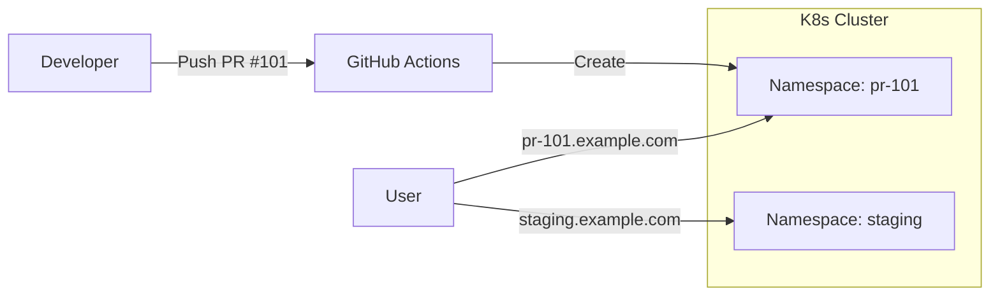
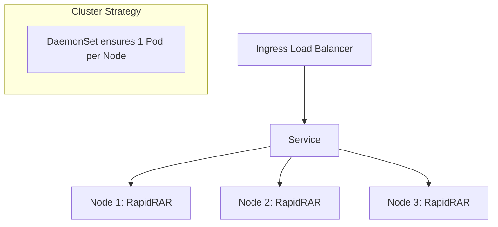

# RapidRAR DevOps Project

<div align="center">

<!-- Button to launch the web presentation -->
[](https://alittlecrocodile.github.io/RapidRAR/)

</div>

## 🚀 Project Overview

This project transforms a CLI tool into a **Cloud-Native Distributed System**.

| Task | Challenge | Key Solution | Tech Stack |
| :--- | :--- | :--- | :--- |
| **Task 1** | Run Python app on any OS (Mac M1/Linux) | **Multi-arch Docker Build** | Docker Buildx, QEMU |
| **Task 2** | Maximize CPU usage on all cluster nodes | **K8s DaemonSet** | Kubernetes, Python API |
| **Task 3** | Test PRs safely without breaking Staging | **Namespace Isolation** | GitHub Actions, Ingress |
| **Bonus** | Security & Cost Management | **App Auth & Auto-Cleanup** | API Key, K8s CronJob |

---

## 🛠 Architecture Highlights

### 1. Ephemeral PR Environments (Task 3)
We solved the "Shared Staging Conflict" by creating dynamic, isolated environments for every Pull Request.



### 2. Distributed Computation (Task 2)
Using **DaemonSet** ensures that RapidRAR scales horizontally to every node in the cluster automatically.



---

## 📂 Deliverables

- **Source Code**: [src/api.py](src/api.py) (FastAPI Wrapper)
- **Deployment**: [k8s/](k8s/) (Kubernetes Manifests)
- **CI/CD**: [.github/workflows/](.github/workflows/) (GitHub Actions)
- **Design Doc**: [DESIGN.md](DESIGN.md) (Detailed Architecture)

## 🏁 How to Run

### 1. Docker (Recommended)
You can run RapidRAR directly as a CLI tool or as an API server.

**Run as CLI Tool:**
```bash
# Verify installation
docker run --rm ghcr.io/alittlecrocodile/rapidrar:experiment-group-assignment rapidrar --help

# Crack a file (mount volume)
docker run --rm -v $(pwd):/data ghcr.io/alittlecrocodile/rapidrar:experiment-group-assignment rapidrar --rar_file /data/sample.rar
```

**Run as API Server:**
```bash
docker run -p 8000:8000 ghcr.io/alittlecrocodile/rapidrar:experiment-group-assignment
```

### 2. Local Installation
Install locally to use the `rapidrar` command directly.

```bash
pip install -e .
rapidrar --help
```

### 3. Kubernetes Deployment
```bash
# Deploy
kubectl apply -f k8s/

# Test deployment (Automatic)
# Note: Ensure you have a sample.rar (or renamed zip) ready
python test_k8s.py http://localhost:8080 sample.rar
```

### 4. API Usage (manual)
```bash
curl -X POST "http://localhost:8000/crack" \
     -H "X-API-Key: dev-secret" \
     -F "file=@sample.rar" \
     -F "min_length=4"
```
